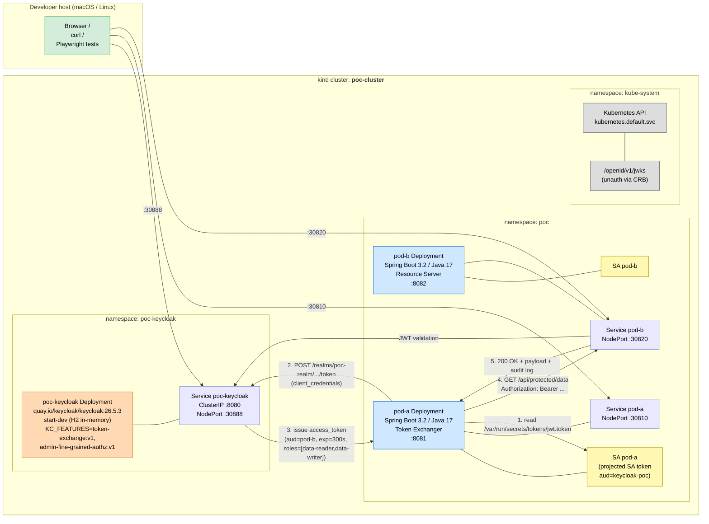
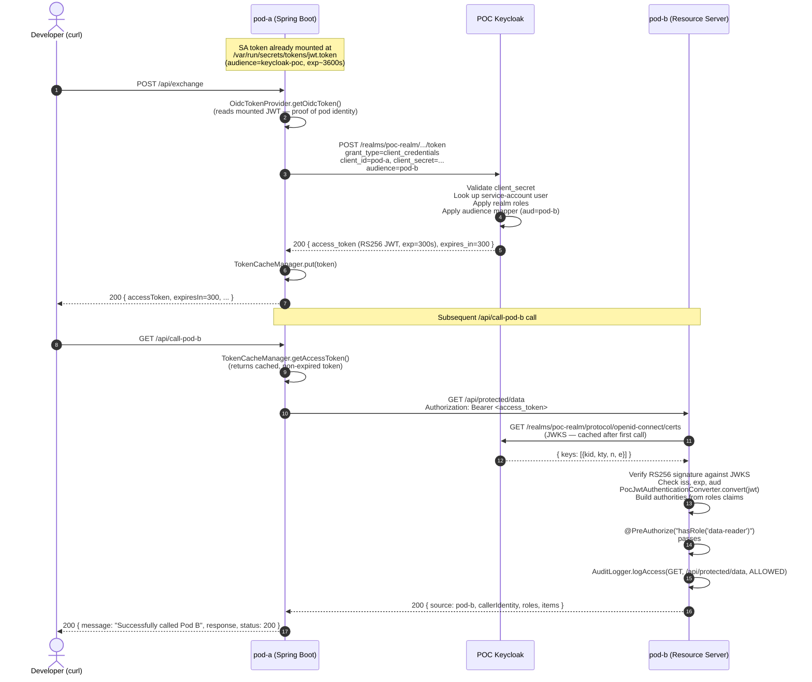
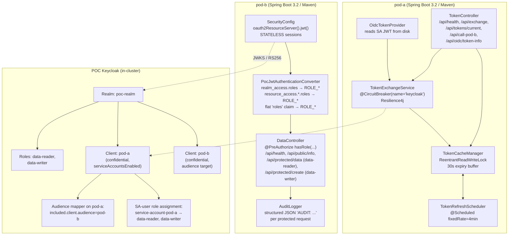
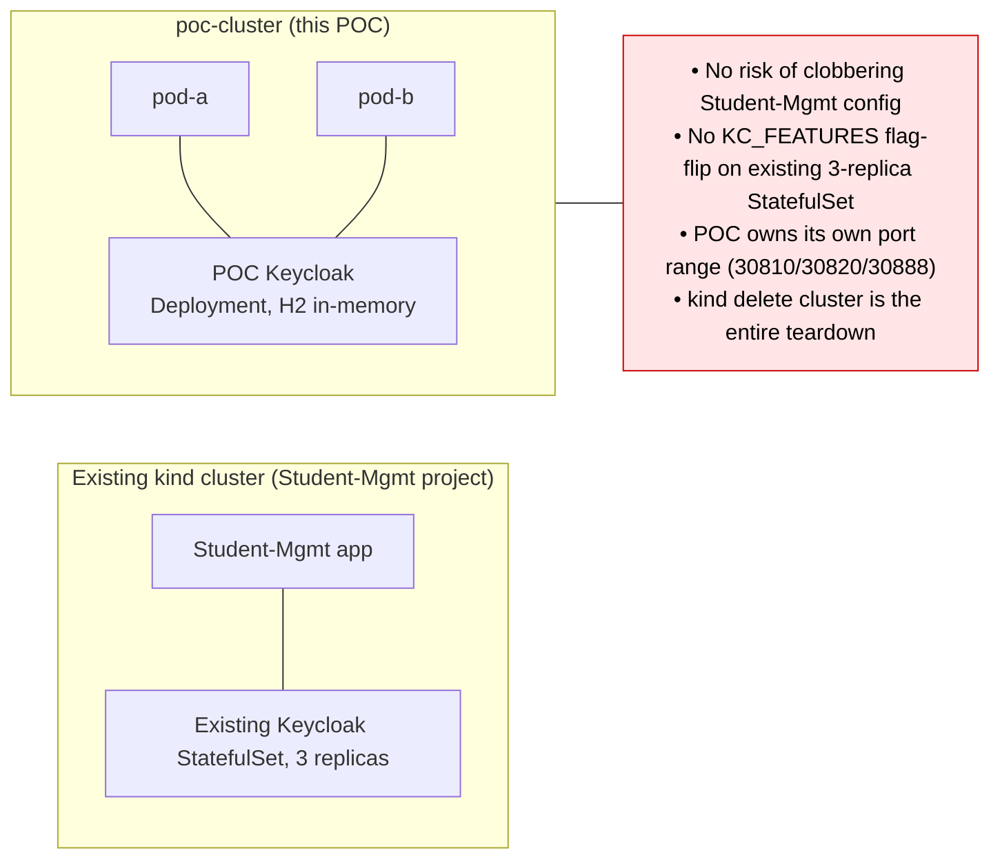
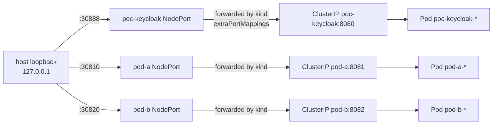

# 02 — Architecture (interactive Mermaid)

> All diagrams in this page render as **interactive SVGs on GitHub**, in any
> Mermaid-aware Markdown viewer (VS Code, IntelliJ, Obsidian, GitLab, …).

---

## 2.1 System diagram

---

## 2.2 Token-exchange sequence

The end-to-end flow when the developer hits `POST /api/exchange` on pod-a
followed by `GET /api/call-pod-b`:

---

## 2.3 Component responsibilities

---

## 2.4 Why a separate kind cluster

The POC cluster is created and destroyed by `scripts/01-create-cluster.sh`
and `scripts/99-cleanup.sh`; it never touches any other kind cluster on the
host.

---

## 2.5 Network exposure

The `extraPortMappings` block in
[`../poc-cluster-config.yaml`](../poc-cluster-config.yaml) directly publishes
each NodePort to the host loopback. This replaces the previous socat
Docker-proxy workaround — when the POC owns its kind cluster, mapping
ports at create-time is the canonical, simplest approach.

---

Next → [03-setup-guide.md](./03-setup-guide.md)
