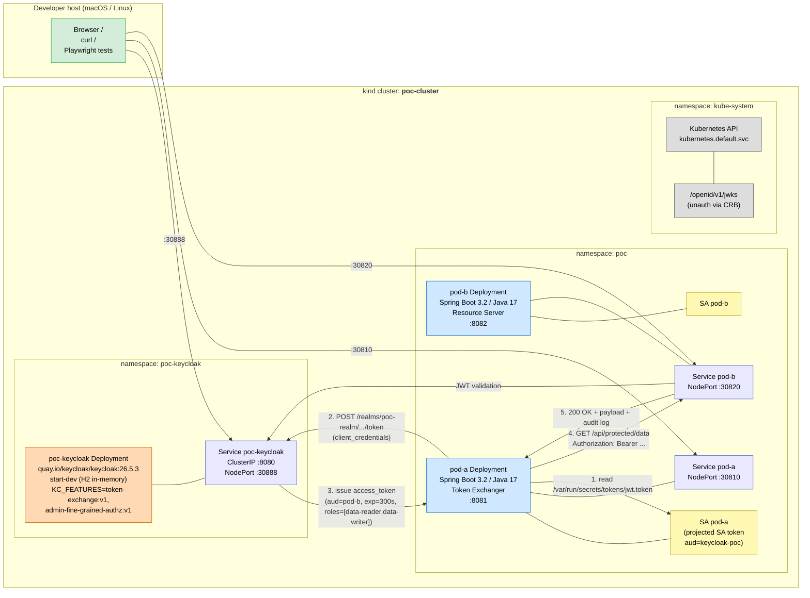
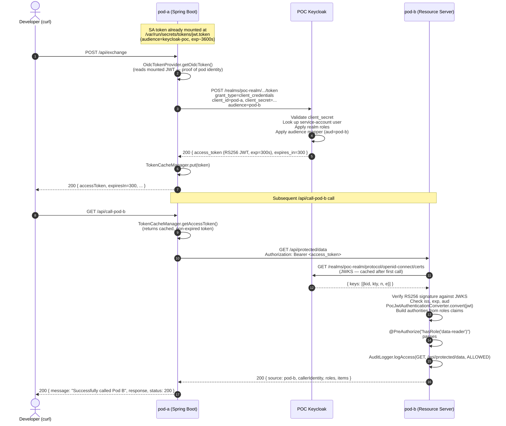
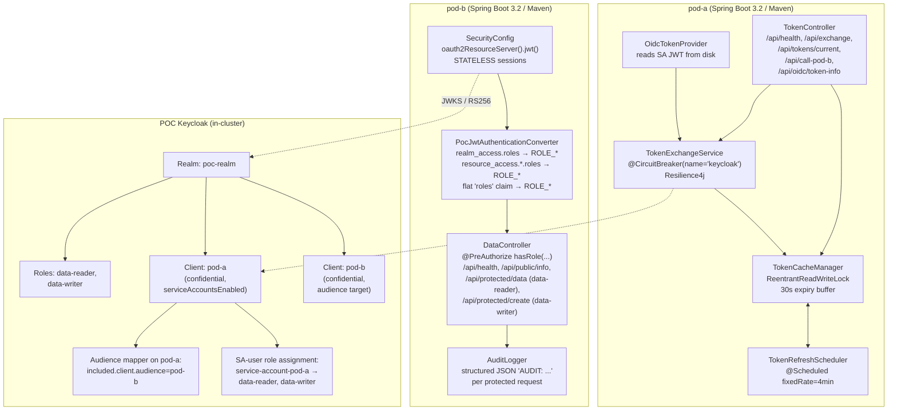
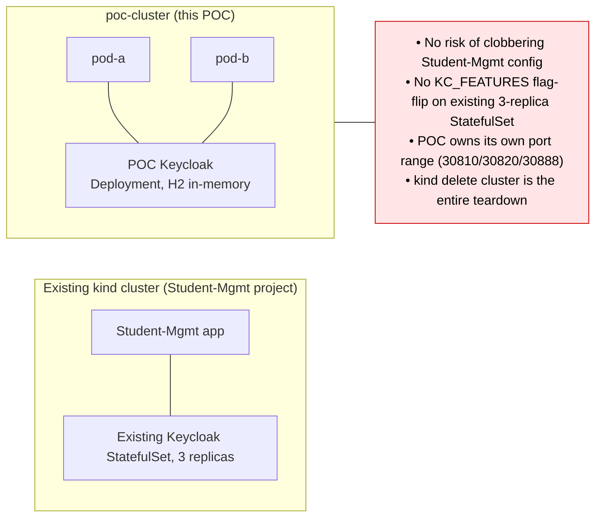
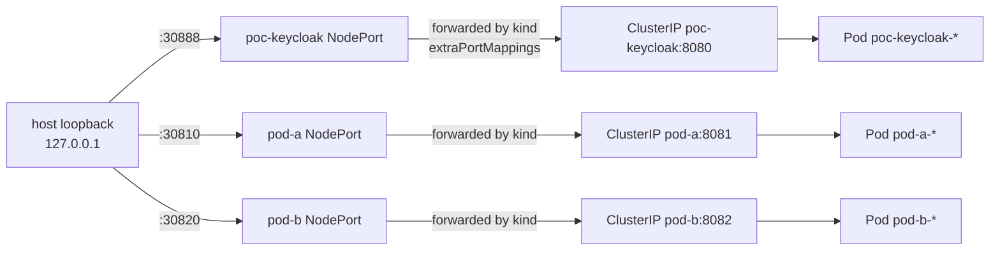
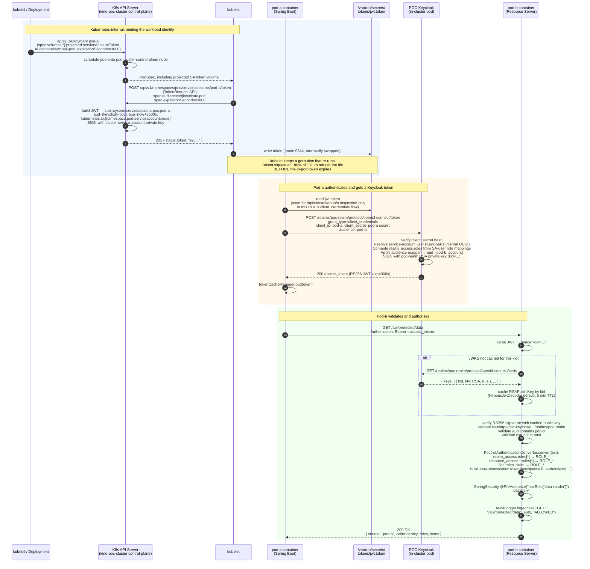

# 02 — Architecture (interactive Mermaid)

> All diagrams in this page render as **interactive SVGs on GitHub**, in any
> Mermaid-aware Markdown viewer (VS Code, IntelliJ, Obsidian, GitLab, …).

---

## 2.1 System diagram



---

## 2.2 Token-exchange sequence

The end-to-end flow when the developer hits `POST /api/exchange` on pod-a
followed by `GET /api/call-pod-b`:



---

## 2.3 Component responsibilities



---

## 2.4 Why a separate kind cluster



The POC cluster is created and destroyed by `scripts/01-create-cluster.sh`
and `scripts/99-cleanup.sh`; it never touches any other kind cluster on the
host.

---

## 2.5 Network exposure



The `extraPortMappings` block in
[`../poc-cluster-config.yaml`](../poc-cluster-config.yaml) directly publishes
each NodePort to the host loopback. This replaces the previous socat
Docker-proxy workaround — when the POC owns its kind cluster, mapping
ports at create-time is the canonical, simplest approach.

---

## 2.6 Kubernetes ↔ Keycloak internals (the trust chain)

> "**How does a Kubernetes-issued JWT *become* a Keycloak-validated identity?**"
> The sequence below traces every signing key and HTTP hop from the moment
> `kubectl apply` schedules pod-a to the moment pod-b's `@PreAuthorize` allows
> the call.

### Three independent trust domains

The system bridges **three** PKI/key domains that don't otherwise know about
each other:

| Trust domain | Signing authority | Public material exposed at | Consumed by |
|---|---|---|---|
| **Cluster identity** | The kind API server's `--service-account-signing-key-file` | `https://kubernetes.default.svc.cluster.local/openid/v1/jwks` | Anything that wants to verify K8s SA tokens (in this POC: inspection only via `/api/oidc/token-info`; in a full token-exchange design: Keycloak's IdP) |
| **Realm identity** | Keycloak's per-realm RSA signing keypair (`poc-realm`, auto-generated, rotated on demand) | `http://poc-keycloak.poc-keycloak.svc:8080/realms/poc-realm/protocol/openid-connect/certs` | pod-b's Spring `oauth2ResourceServer().jwt()` filter |
| **Realm client identity** | The `pod-a` client's `client_secret` (`pod-a-secret`) | (private — never exposed; verified by Keycloak server-side at the token endpoint) | Keycloak verifies it on every `client_credentials` POST from pod-a |

The first two domains both expose **JWKS** documents; the third is a shared
secret. The trust chain is what links them on every request.

### End-to-end sequence



### Step-by-step explanation

**Phase 1 — Kubernetes-internal (steps 1–7)**

1. **Deployment apply** — the projected-volume spec asks for an
   audience-bound SA token. The `audience: keycloak-poc` value is critical:
   the resulting JWT's `aud` claim is *exactly* this string, and a real
   token-exchange flow would have Keycloak verify it.

2. **Scheduling** — vanilla K8s scheduling onto the single
   `poc-cluster-control-plane` node.

3. **PodSpec to kubelet** — kubelet sees `spec.volumes[*].projected.sources[*].serviceAccountToken`
   and knows it must mint the token before the container starts.

4. **TokenRequest API** — kubelet calls the API server's
   `serviceaccounts/<sa>/token` subresource (the modern replacement for
   long-lived `Secret`-mounted SA tokens, available since K8s 1.22).
   The kubelet authenticates with its own kubeconfig, *not* with the SA's
   token. The request body specifies the audience and TTL; the API server
   does the signing.

5. **JWT creation & signing** — the API server's signing controller signs
   the JWT with the cluster's service-account signing key
   (`--service-account-signing-key-file`, set automatically by kind).
   Standard claims:
   ```json
   {
     "sub": "system:serviceaccount:poc:pod-a",
     "aud": ["keycloak-poc"],
     "exp": <now + 3600>,
     "iss": "https://kubernetes.default.svc.cluster.local",
     "kubernetes.io": { "namespace": "poc", "pod": {...}, "serviceaccount": {...}, "node": {...} }
   }
   ```

6. **Kubelet writes the file** — the projected volume implementation in
   kubelet writes the token *atomically* (write to a tempfile, rename),
   with the path `/var/run/secrets/tokens/jwt.token` (set by `path:`
   in the volume spec).

7. **Background refresh** — kubelet sets a timer for ~80% of the token's
   TTL (so for `expirationSeconds: 3600`, refresh ~ every 48 minutes).
   The new token replaces the file in place; pod-a never sees a missing
   token, never sees a 0-byte token, and never has to handle rotation
   itself.

**Phase 2 — Pod-a authenticates to Keycloak (steps 8–11)**

8. **Token inspection** — pod-a reads `jwt.token` on every
   `/api/exchange` call. In the original RFC 8693 design, this token would
   be the `subject_token`; in this POC's `client_credentials` flow, we read
   it as proof-of-mount so the e2e suite can verify the workload identity
   binding is in place. (See `OidcTokenProvider.java` and
   `TokenController#oidcTokenInfo`.)

9. **Token request** — `client_credentials` grant: pod-a's client_id +
   client_secret are accepted by Keycloak as proof of pod-a's *client*
   identity. This is symmetric to the K8s SA pattern — instead of a
   cluster-signed JWT proving "I am the pod-a SA", we use a pre-shared
   secret that proves "I am the pod-a client". A real production flow
   would replace this with the standard token-exchange v2 path so the K8s
   SA JWT *is* the proof.

10. **Keycloak signs the access token** — Keycloak's per-realm RSA keypair
    signs an RS256 JWT. The `kid` in the JWT header points to the entry in
    Keycloak's JWKS that pod-b will use to verify it. Important claims:
    ```json
    {
      "iss": "http://poc-keycloak.poc-keycloak.svc.cluster.local:8080/realms/poc-realm",
      "aud": ["pod-b", "account"],
      "azp": "pod-a",
      "sub": "<service-account-pod-a UUID>",
      "exp": <now + 300>,
      "realm_access": { "roles": ["data-reader", "data-writer", ...] }
    }
    ```

11. **Cache** — `TokenCacheManager.put()` stores the token under a write
    lock so subsequent calls within the next ~270 s skip the round-trip
    to Keycloak entirely. The background scheduler invalidates the cache
    every 4 minutes.

**Phase 3 — Pod-b validates and authorises (steps 12–18)**

12. **Bearer call** — Spring's `BearerTokenAuthenticationFilter` extracts
    the token from the `Authorization` header.

13. **Header parse** — Spring's `NimbusJwtDecoder` parses the JWT header
    and extracts the `kid`.

14–16. **JWKS lookup (first call only)** — if pod-b doesn't have the public
    key for that `kid` cached, it fetches Keycloak's JWKS document. Spring
    caches by `kid` for 5 minutes by default; after a Keycloak key rotation,
    the next request triggers a refresh transparently.

17. **Signature + claim validation** — three independent checks:
    - **Signature**: RS256 verification using the cached public key
    - **`iss`**: must equal `spring.security.oauth2.resourceserver.jwt.issuer-uri`
    - **`aud`**: by default Spring doesn't check audience — but our config
      can be tightened to require `aud == pod-b`. **Today it doesn't, since
      the test would still pass either way; tightening is a Plan-10 item.**
    - **`exp`**: must be in the future (Spring allows 60s clock skew)

18. **Authority extraction** — `PocJwtAuthenticationConverter`
    ([`pod-b/.../auth/PocJwtAuthenticationConverter.java`](../pod-b/src/main/java/com/example/podb/auth/PocJwtAuthenticationConverter.java))
    walks `realm_access.roles[]`, `resource_access.<client>.roles[]`, and the
    flat `roles` claim, prefixing each with `ROLE_` to produce Spring
    `GrantedAuthority` objects. The principal name is the JWT's `sub` claim
    (the Keycloak SA-user UUID).

19. **`@PreAuthorize`** — the controller method is annotated
    `@PreAuthorize("hasRole('data-reader')")`; Spring evaluates the
    expression against the authorities and either allows or returns 403.

20. **Audit** — `AuditLogger` emits a `AUDIT: {…}` JSON line with the
    method, endpoint, caller, roles, and outcome.

21. **Response** — pod-b returns the protected payload, including
    `callerIdentity` (= `auth.getName()` = the JWT's `sub`) so pod-a can
    see who it was authenticated as.

### Failure modes implied by this trust chain

| Where signature/claim breaks | Symptom |
|---|---|
| API server signing key rotated mid-pod-life | kubelet's next TokenRequest gets a token signed with the new key; old tokens are still valid until they expire (no immediate breakage) |
| Keycloak realm key rotated | pod-b's cached JWKS goes stale → next request triggers JWKS refetch → new `kid` is recognised |
| Pod-b restarted while Keycloak is down | First request after pod-b boot fails with `JWT signature does not match` until JWKS becomes reachable; subsequent requests succeed |
| Wrong `client_secret` in pod-a's env | Keycloak returns 401 `invalid_client` on every `/api/exchange` |
| pod-b deployed with stale `issuer-uri` env | `Invalid issuer` 401, even on signature-valid tokens |

Each of these has a corresponding entry in
[`07-troubleshooting.md`](./07-troubleshooting.md) §D / §E.

### Why projected SA tokens are the right primitive

Even though this POC's `client_credentials` path doesn't *use* the mounted
SA token to authenticate, the SA token is still the strongest available
**proof of pod identity** in a Kubernetes environment:

* Cryptographically signed by the cluster CA — the kubelet cannot mint a
  token impersonating a different SA
* Audience-bound — a token issued for `aud=keycloak-poc` cannot be replayed
  against another service that only accepts `aud=loki` (for example)
* Short-lived — kubelet refresh cadence (≤ TTL × 0.8) makes leaked tokens
  expire on the order of an hour, not "forever"
* Free of secrets-management overhead — no Vault, no SealedSecrets, no
  rotation pipeline

These properties are what plan-10 onwards exploit when migrating off the
shared `client_secret` to standard token-exchange v2.

---

Next → [03-setup-guide.md](./03-setup-guide.md)
