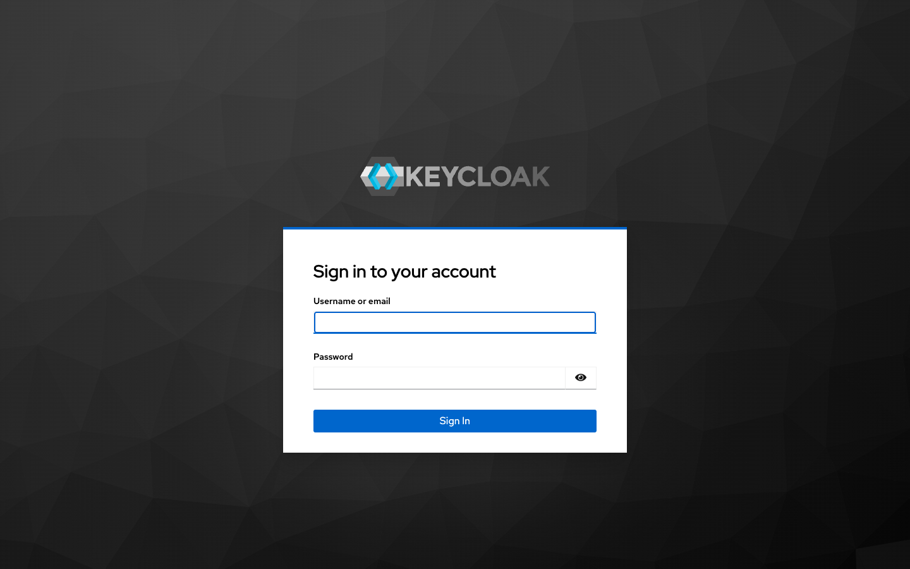
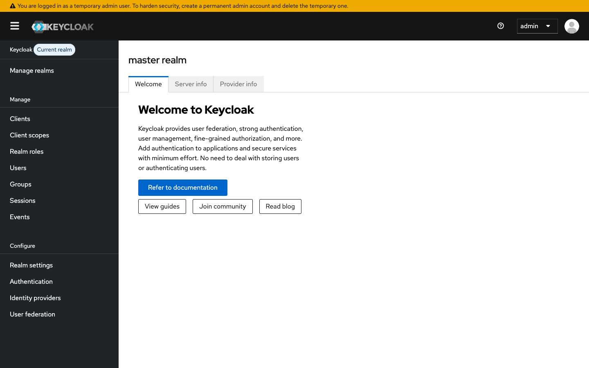

# 03 — Setup Guide (step-by-step)

This guide walks through the complete bootstrap of the POC on a fresh
machine. **Total time: ~5 minutes** on a cold Maven/Docker cache; ~1 min on a
warm one.

The whole pipeline is automated by
[`../scripts/00-setup-all.sh`](../scripts/00-setup-all.sh) — but understanding
each step pays off the first time something goes wrong.

---

## 0. Prerequisites

| Tool | Version | Why |
|---|---|---|
| Docker Desktop / Docker daemon | ≥ 24 | kind needs a container runtime |
| `kind` | ≥ v0.22 | Local Kubernetes |
| `kubectl` | ≥ v1.28 | API client |
| `curl`, `jq`, `python3` | recent | realm REST scripts + JSON manipulation |
| `node` + `npm` | Node ≥ 18 | Playwright suite |
| (optional) `mvn` ≥ 3.9 + JDK 17 | only if you want to build outside Docker |

The Maven build is fully containerised in
[`../pod-a/Dockerfile`](../pod-a/Dockerfile) /
[`../pod-b/Dockerfile`](../pod-b/Dockerfile) — you do **not** need Java/Maven on
the host.

---

## 1. Create the POC kind cluster

```bash
./scripts/01-create-cluster.sh
```

What it does:
- Reads [`../poc-cluster-config.yaml`](../poc-cluster-config.yaml) (single
  control-plane node + 3 `extraPortMappings`)
- Runs `kind create cluster --name poc-cluster --config …`
- Switches `kubectl` context to `kind-poc-cluster`

```text
==> Creating kind cluster 'poc-cluster' from .../poc-cluster-config.yaml...
 ✓ Ensuring node image (kindest/node:v1.35.0) 🖼
 ✓ Preparing nodes 📦
 ✓ Writing configuration 📜
 ✓ Starting control-plane 🕹️
 ✓ Installing CNI 🔌
 ✓ Installing StorageClass 💾
Set kubectl context to "kind-poc-cluster"
==> Cluster info:
Kubernetes control plane is running at https://127.0.0.1:52023
==> Nodes:
NAME                        STATUS   ROLES           AGE   VERSION
poc-cluster-control-plane   Ready    control-plane   25s   v1.35.0
```

Verification:

```bash
kind get clusters | grep poc-cluster      # → poc-cluster
kubectl config current-context            # → kind-poc-cluster
kubectl get nodes                         # → 1 Ready node
```

> **Why a single-node cluster?** The whole POC is 3 pods (1 Keycloak + pod-a
> + pod-b). Workers buy nothing here and add ~60s to cluster boot.

---

## 2. Deploy POC Keycloak

```bash
./scripts/02-deploy-poc-keycloak.sh
```

This applies (in order):
1. [`../k8s-manifests/poc-keycloak/01-namespace.yaml`](../k8s-manifests/poc-keycloak/01-namespace.yaml) — creates namespace `poc-keycloak`
2. [`../k8s-manifests/poc-keycloak/02-deployment.yaml`](../k8s-manifests/poc-keycloak/02-deployment.yaml) — Keycloak 26.5.3, `start-dev`, with these env vars:
   - `KC_FEATURES=token-exchange:v1,admin-fine-grained-authz:v1` — explicitly enable the **legacy V1** features (the V2 defaults don't fit our flow; see [01-overview.md](./01-overview.md#architectural-pivots-made-during-build))
   - `KC_HTTP_ENABLED=true`, `KC_HOSTNAME_STRICT=false` — let the admin UI work over HTTP for local POC
   - `KC_TRUSTSTORE_PATHS=/var/run/secrets/kubernetes.io/serviceaccount/ca.crt` — so Keycloak's HTTP client trusts the K8s API self-signed cert (used by the IdP JWKS fetch)
3. [`../k8s-manifests/poc-keycloak/03-service.yaml`](../k8s-manifests/poc-keycloak/03-service.yaml) — `NodePort 30888`, mapped on the host by `extraPortMappings`

Then it waits for `/health/ready` (probed via `kubectl exec` since the
Keycloak distroless image has no `curl`) and verifies the host port is
reachable.

Expected end-state:
```text
==> POC Keycloak deployed.
    Namespace:   poc-keycloak
    In-cluster:  http://poc-keycloak.poc-keycloak.svc.cluster.local:8080
    Host:        http://127.0.0.1:30888
    Admin:       admin / admin
```

Open the admin UI in a browser:

> **`http://127.0.0.1:30888`** → click **Administration Console** → log in `admin / admin`



After login you land on the master realm:



---

## 3. Apply the JWKS-discovery RBAC

```bash
./scripts/03-jwks-discovery-rbac.sh
```

Applies [`../k8s-manifests/00-jwks-rbac.yaml`](../k8s-manifests/00-jwks-rbac.yaml):

```yaml
kind: ClusterRoleBinding
metadata:
  name: poc-service-account-issuer-discovery-unauthenticated
subjects: [{kind: Group, name: system:unauthenticated, ...}]
roleRef: { kind: ClusterRole, name: system:service-account-issuer-discovery, ...}
```

Then verifies by spinning up an ephemeral `curlimages/curl` pod and
fetching `https://kubernetes.default.svc.cluster.local/openid/v1/jwks`.

```text
==> Applying JWKS discovery RBAC...
clusterrolebinding.rbac.authorization.k8s.io/poc-service-account-issuer-discovery-unauthenticated created
==> Verifying JWKS endpoint reachable from inside the cluster...
    JWKS endpoint reachable; 1 key(s) returned.
```

> **Why this binding?** The K8s API's `/openid/v1/jwks` endpoint requires
> the caller to be in the `system:service-account-issuer-discovery` group.
> Granting that to `system:unauthenticated` lets POC Keycloak (or any pod)
> fetch the cluster's signing keys without a bearer token. Some kind versions
> ship this binding by default; this script applies it idempotently.

---

## 4. Build pod-a + pod-b images

```bash
./scripts/05-build-and-load.sh
```

Multi-stage Dockerfile build (Maven 3.9 + Eclipse Temurin 17 → JRE 17), then
`kind load docker-image …:latest --name poc-cluster` so kind's containerd
sees the image without needing a registry.

```text
==> kind cluster: poc-cluster

==> Building pod-a image -> pod-a:latest
[+] Building 0.5s ...
==> Loading pod-a:latest into kind cluster 'poc-cluster'
Image: "pod-a:latest" with ID "sha256:..." not yet present, loading...

==> Building pod-b image -> pod-b:latest
[+] Building 0.5s ...
==> Loading pod-b:latest into kind cluster 'poc-cluster'
```

Cold cache: ~2-3 min per image (Maven `dependency:go-offline`).
Warm: ~10s per image (BuildKit cache + only changed source layers rebuild).

Verify:
```bash
docker exec poc-cluster-control-plane crictl images | grep pod-
# pod-a:latest
# pod-b:latest
```

---

## 5. Configure the `poc-realm`

```bash
./scripts/04-setup-poc-realm.sh
```

This script talks to Keycloak's admin REST API at `http://127.0.0.1:30888`
(via the `extraPortMappings` host port). Idempotent for fresh runs; safely
no-ops if artefacts already exist.

What it creates:

| # | Artefact | Why |
|---|---|---|
| 1 | Realm `poc-realm` | Isolation from `master` |
| 2 | Realm role `data-reader` | RBAC: read access |
| 3 | Realm role `data-writer` | RBAC: write access |
| 4 | Client `pod-b` (confidential) | The audience target |
| 5 | Client `pod-a` (confidential, `serviceAccountsEnabled=true`) | The workload identity |
| 6 | Audience mapper on pod-a | Mints tokens with `aud=pod-b` |
| 7 | Realm-role assignment to `service-account-pod-a` user | Grants pod-a's tokens both roles |

Output:
```text
==> Creating realm 'poc-realm'...
    realm created
==> Creating realm role 'data-reader'...     role created
==> Creating realm role 'data-writer'...     role created
==> Creating client 'pod-b'...               pod-b client created
==> Creating client 'pod-a'...               pod-a client created
==> Adding audience mapper (pod-b audience) to pod-a...     audience mapper created
==> Assigning realm roles to pod-a service account...       roles assigned

==> Realm setup complete.
    Realm:           poc-realm
    Roles:           data-reader, data-writer
    Clients:         pod-a (public), pod-b (confidential)
    Token exchange:  pod-a → audience=pod-b
```

Now switch to `poc-realm` in the admin UI: **Manage realms** → **poc-realm**.


> A detailed Keycloak walkthrough with screenshots is in
> [04-keycloak-configuration.md](./04-keycloak-configuration.md).

---

## 6. Deploy pod-a + pod-b

```bash
./scripts/06-deploy-pods.sh
```

Applies all 6 manifests under `k8s-manifests/poc/`:

| # | File | Object |
|---|---|---|
| 1 | [`01-namespace.yaml`](../k8s-manifests/poc/01-namespace.yaml) | `Namespace poc` |
| 2 | [`02-service-accounts.yaml`](../k8s-manifests/poc/02-service-accounts.yaml) | `SA pod-a`, `SA pod-b` |
| 3 | [`03-pod-a-deployment.yaml`](../k8s-manifests/poc/03-pod-a-deployment.yaml) | pod-a Deployment with **projected SA token volume** (audience `keycloak-poc`, exp 3600s) |
| 4 | [`04-pod-a-service.yaml`](../k8s-manifests/poc/04-pod-a-service.yaml) | NodePort 30810 |
| 5 | [`05-pod-b-deployment.yaml`](../k8s-manifests/poc/05-pod-b-deployment.yaml) | pod-b Deployment, env points `SPRING_SECURITY_OAUTH2_RESOURCESERVER_JWT_ISSUER_URI` at the in-cluster Keycloak |
| 6 | [`06-pod-b-service.yaml`](../k8s-manifests/poc/06-pod-b-service.yaml) | NodePort 30820 |

Then `kubectl rollout restart` to pick up freshly-loaded images, waits for
`/api/health` on both NodePorts.

```text
==> Pods deployed and reachable:
    pod-a:  http://127.0.0.1:30810
    pod-b:  http://127.0.0.1:30820
```

---

## 7. Smoke-test the flow

```bash
./scripts/07-test-flow.sh
```

The script walks 8 checks (see
[`../scripts/07-test-flow.sh`](../scripts/07-test-flow.sh) for the source):

```text
[1] pod-a /api/health           → 200 {"status":"UP","pod":"pod-a"}
[2] pod-b /api/health           → 200 {"status":"UP","pod":"pod-b"}
[3] pod-b /api/public/info      → 200 (no auth)
[4] pod-b /api/protected/data WITHOUT token  → 401
[5] pod-a /api/exchange         → 200, returns access_token
[6] decode token claims         → aud=pod-b, roles=[data-reader,data-writer]
[7] pod-b /api/protected/data WITH token  → 200, payload + caller identity
[8] pod-a /api/call-pod-b       → 200 (S2S using cached token)

✅ End-to-end test completed successfully!
```

---

## 8. Run the 45-test Playwright suite

```bash
./scripts/08-run-e2e.sh
```

```text
Running 45 tests using 1 worker

  ✓  1 [chromium] › 01-token-exchange.spec.ts › Pod A is healthy (9ms)
  ✓  2 [chromium] › 01-token-exchange.spec.ts › Pod B is healthy (5ms)
  ...
  ✓ 45 [chromium] › 07-performance.spec.ts › Sustained 30-call burst remains healthy (252ms)

  45 passed (1.5s)
```

HTML report: open `e2e-tests/playwright-report/index.html`.

---

## 9. (When you're done) Tear it all down

```bash
./scripts/99-cleanup.sh
```

This deletes the entire `poc-cluster` kind cluster — no leftover state.

```text
==> Deleting kind cluster 'poc-cluster'...
Deleting cluster "poc-cluster" ...
==> Cleanup complete.
```

---

## One-shot bootstrap

All of the above, in one command:

```bash
./scripts/00-setup-all.sh
```

| Stage | Script | Approx duration (warm) |
|---|---|---|
| 1/7 Create kind cluster | `01-create-cluster.sh` | 25–40 s |
| 2/7 Deploy POC Keycloak | `02-deploy-poc-keycloak.sh` | 60–90 s (Keycloak boot + readiness) |
| 3/7 JWKS discovery RBAC | `03-jwks-discovery-rbac.sh` | < 5 s |
| 4/7 Build images | `05-build-and-load.sh` | 10–30 s warm / 3–5 min cold |
| 5/7 Configure realm | `04-setup-poc-realm.sh` | 5–10 s |
| 6/7 Deploy pods | `06-deploy-pods.sh` | 30–60 s |
| 7/7 Smoke test | `07-test-flow.sh` | 5 s |
| **Total** |  | **~3–5 min warm / ~7–10 min cold** |

---

Next → [04-keycloak-configuration.md](./04-keycloak-configuration.md) for a
Keycloak-side walkthrough with screenshots, or
[05-manual-testing-guide.md](./05-manual-testing-guide.md) for manual test
scenarios.
