# 04 — Keycloak Configuration walkthrough

This document is the screenshot-driven tour of every Keycloak artefact the
POC creates. **All screenshots were captured automatically against the live
`poc-cluster` Keycloak by [`../e2e-tests/capture-screenshots.ts`](../e2e-tests/capture-screenshots.ts);
re-run it after a Keycloak version bump or admin-UI change.**

You can follow this guide manually in the admin UI at
**http://127.0.0.1:30888** (admin / admin), or just read the screenshots
side-by-side with [`../scripts/04-setup-poc-realm.sh`](../scripts/04-setup-poc-realm.sh)
to see the REST calls that produce each artefact.

---

## 4.1 Realms list — switching to `poc-realm`

After login, the admin UI lands on the **master** realm. To work with our
POC realm, click **Manage realms** in the left sidebar:

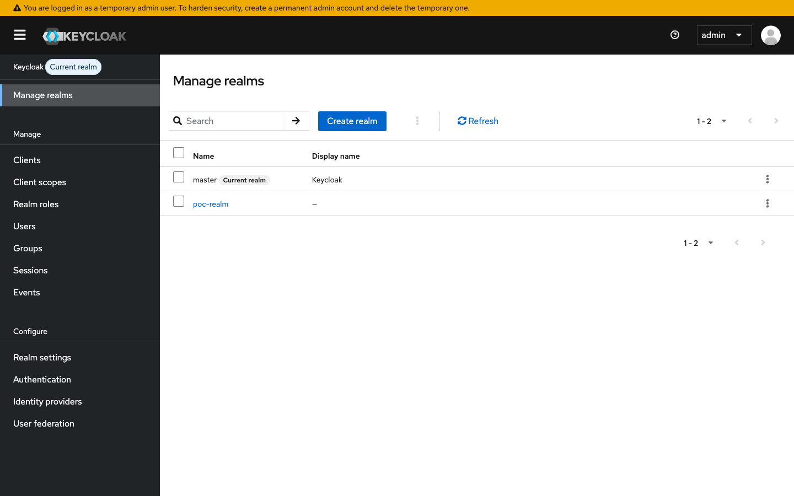

`poc-realm` is created by [`scripts/04-setup-poc-realm.sh`](../scripts/04-setup-poc-realm.sh)
via `POST /admin/realms` with this body:

```json
{
  "realm": "poc-realm",
  "enabled": true,
  "sslRequired": "none",
  "accessTokenLifespan": 300
}
```

Click on **poc-realm** to switch the admin console context:

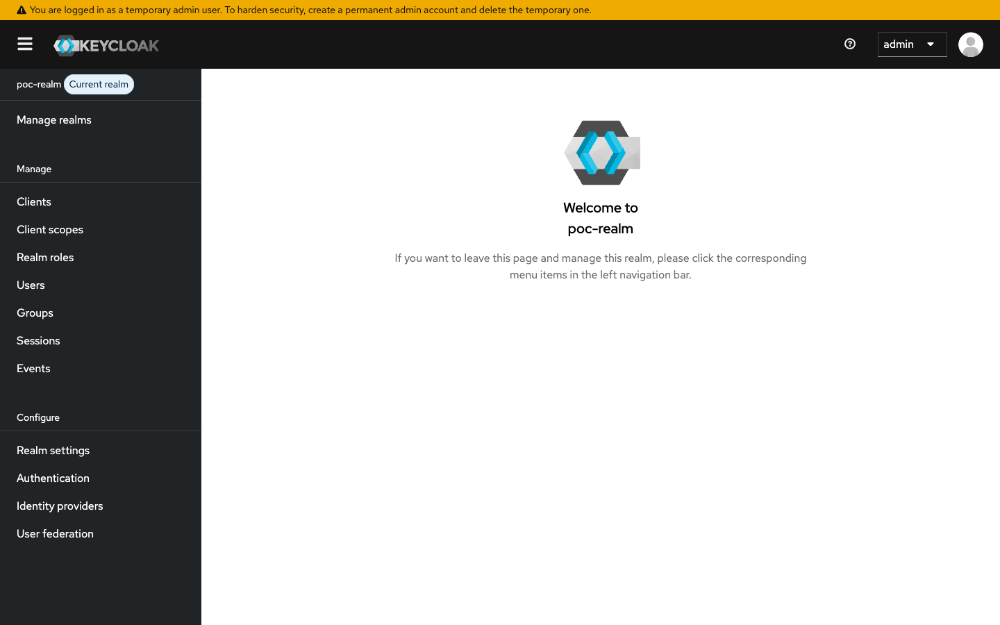

Note the `poc-realm  Current realm` label at the top-left — every action
from here is realm-scoped.

---

## 4.2 Clients

Sidebar → **Clients**:

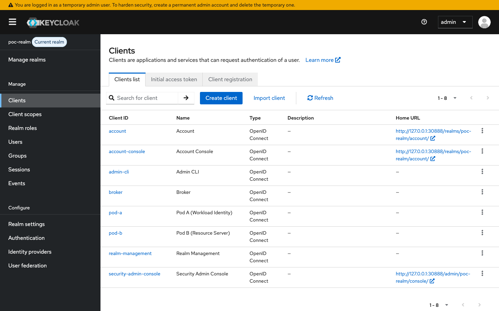

Two clients are listed alongside Keycloak's built-in clients:

| clientId | Type | Purpose |
|---|---|---|
| `pod-a` | Confidential | The workload identity for pod-a; uses `client_credentials` grant; carries the audience mapper that puts `pod-b` in minted tokens |
| `pod-b` | Confidential | The audience target — pod-b's JWT validator checks `aud=pod-b` |

### 4.2.1 `pod-a` client — Settings

Click **pod-a** in the table:

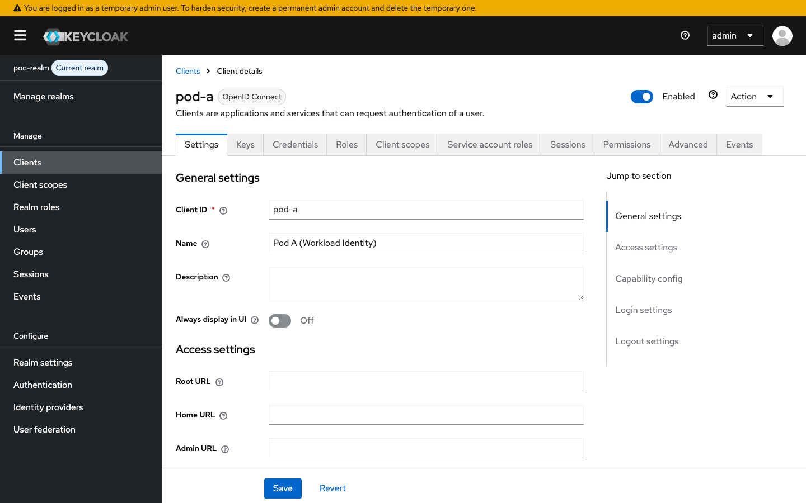

Key fields:
- **Client ID:** `pod-a`
- **Name:** `Pod A (Workload Identity)`
- **Enabled:** ✅
- The **Settings** tab is split into General / Access / Capability / Login /
  Logout sections — for the POC, only `serviceAccountsEnabled` matters
  (visible under **Capability config** further down the page).

### 4.2.2 `pod-a` client — Credentials

The **Credentials** tab is where pod-a's `client_secret` lives:

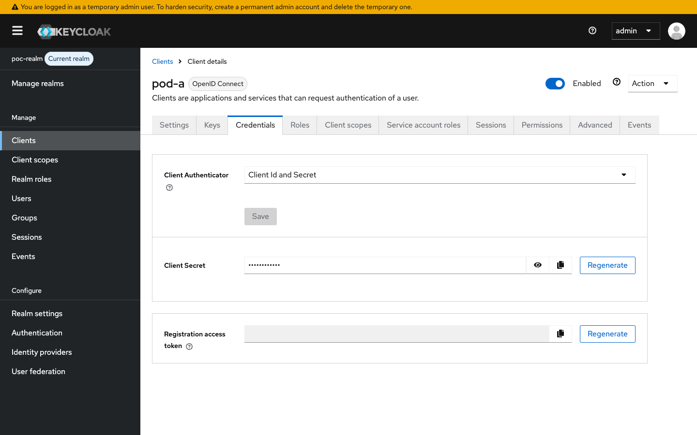

The realm-setup script seeds this with `pod-a-secret`. Pod-a reads it from
the env var `KEYCLOAK_CLIENT_SECRET` (set in
[`../k8s-manifests/poc/03-pod-a-deployment.yaml`](../k8s-manifests/poc/03-pod-a-deployment.yaml#L36-L37))
and uses it on `client_credentials` grant requests. **In production, this
would be a Kubernetes `Secret` — for the POC it's an env var.**

### 4.2.3 `pod-a` client — Service account roles

Because we set `serviceAccountsEnabled=true` when creating pod-a, Keycloak
auto-creates a hidden user named `service-account-pod-a` whose realm-role
mappings determine the *roles claim* of every token minted via
`client_credentials`. The **Service account roles** tab shows that user's
mappings:

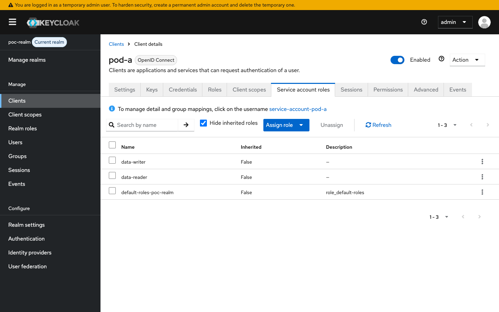

The realm-setup script assigns both `data-reader` and `data-writer` here
via:

```bash
POST /admin/realms/poc-realm/users/${SA_USER_ID}/role-mappings/realm
```

(see [`../scripts/04-setup-poc-realm.sh`](../scripts/04-setup-poc-realm.sh#L120-L143)).

### 4.2.4 `pod-a` client — Client scopes (audience mapper)

The **Client scopes** tab shows pod-a's dedicated client scope:

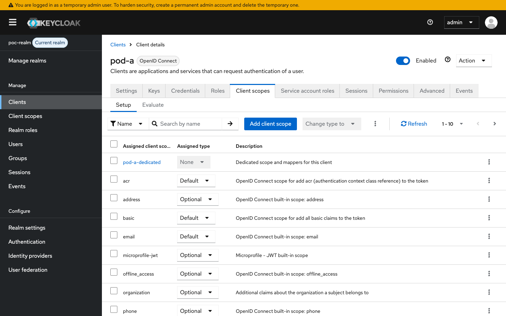

Inside the dedicated `pod-a-dedicated` scope (drill in to see) lives the
**audience-pod-b** protocol mapper — a built-in `oidc-audience-mapper`
configured with `included.client.audience: pod-b`. This is what causes every
access token issued for pod-a to include `aud=pod-b`, which pod-b's
resource-server then validates.

Created by:
```bash
POST /admin/realms/poc-realm/clients/${POD_A_ID}/protocol-mappers/models
{ "name": "audience-pod-b",
  "protocol": "openid-connect",
  "protocolMapper": "oidc-audience-mapper",
  "config": { "included.client.audience": "pod-b",
              "id.token.claim": "false",
              "access.token.claim": "true" } }
```
(see [`../scripts/04-setup-poc-realm.sh`](../scripts/04-setup-poc-realm.sh#L94-L115)).

### 4.2.5 `pod-b` client — Settings

Back to **Clients** → **pod-b**:

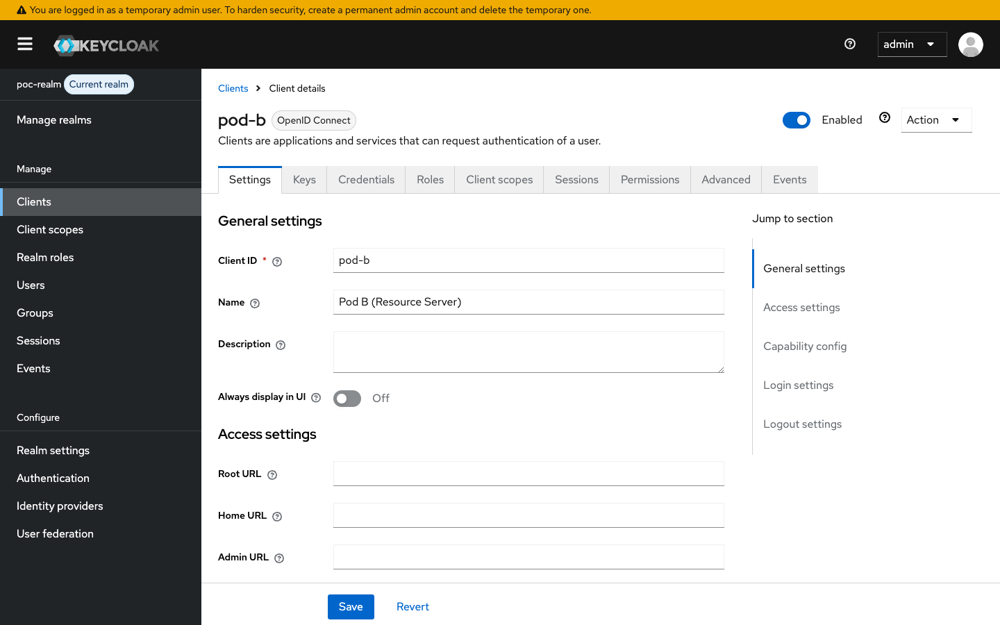

Pod-b is configured as confidential but **not** for direct grants (pod-b is a
resource server only — it never *requests* tokens, only *validates* them).
The only thing pod-b needs is to *exist* as a client so that other clients'
audience mappers can target it.

---

## 4.3 Realm roles

Sidebar → **Realm roles**:

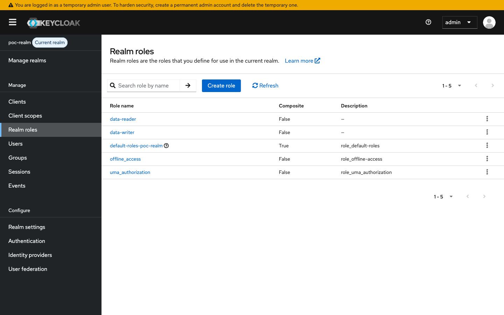

Two custom roles plus Keycloak's built-in `default-roles-poc-realm`,
`offline_access`, `uma_authorization`:

| Role | Used by |
|---|---|
| `data-reader` | `@PreAuthorize("hasRole('data-reader')")` on `pod-b` GET endpoints |
| `data-writer` | `@PreAuthorize("hasRole('data-writer')")` on `pod-b` POST endpoints |

Created by:
```bash
POST /admin/realms/poc-realm/roles
{ "name": "data-reader" }
```

The role names land in the access token's `realm_access.roles` array, e.g.:

```json
{
  "realm_access": {
    "roles": ["default-roles-poc-realm", "offline_access",
              "data-writer", "uma_authorization", "data-reader"]
  }
}
```

`PocJwtAuthenticationConverter` ([`../pod-b/src/main/java/com/example/podb/auth/PocJwtAuthenticationConverter.java`](../pod-b/src/main/java/com/example/podb/auth/PocJwtAuthenticationConverter.java))
walks both `realm_access.roles` and `resource_access.*.roles` and prefixes
each with `ROLE_`, which is what Spring Security's `hasRole(...)`
expression matches.

---

## 4.4 Users — the service-account user

Sidebar → **Users**:

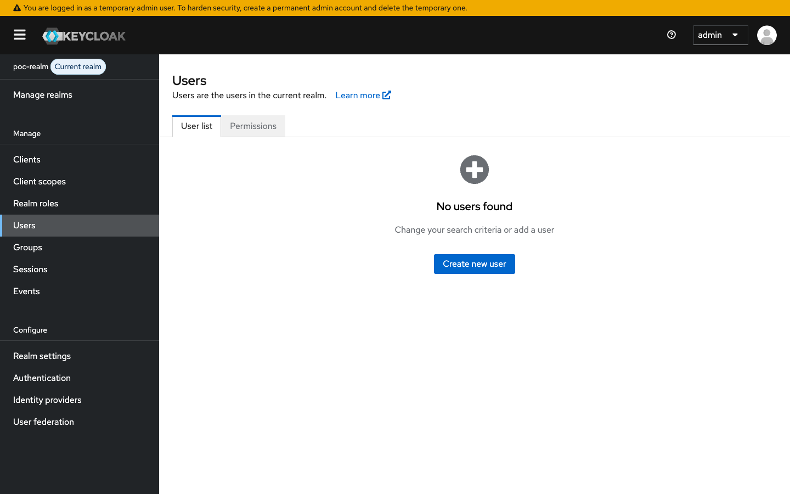

`service-account-pod-a` is the only user — Keycloak auto-creates it because
`pod-a` has `serviceAccountsEnabled=true`. **You never create or manage this
user manually.**

Click **service-account-pod-a**:

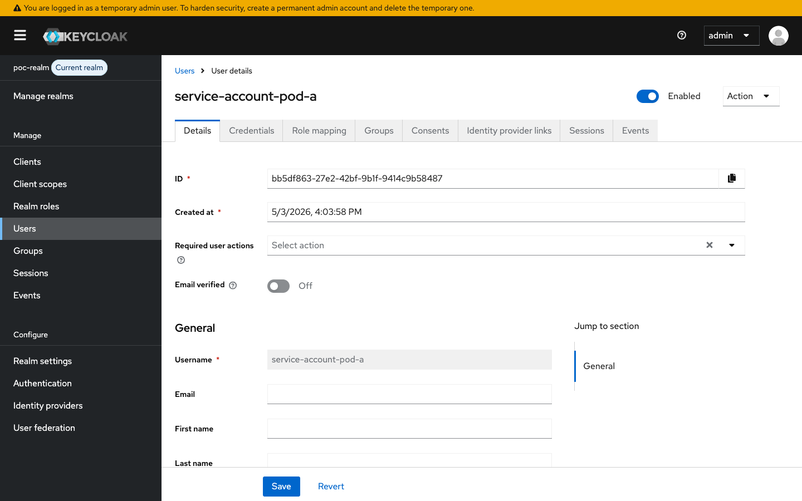

The username is fixed (`service-account-<clientId>`); it's not editable.
What *is* editable — and what matters for the POC — is the **Role mapping**
tab:

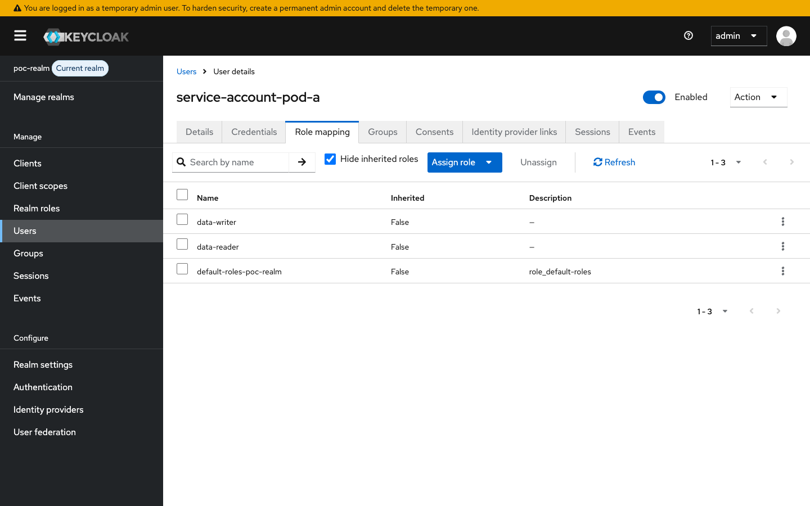

You should see **data-reader** and **data-writer** assigned at the realm
level. These are the roles that get baked into the JWT's `realm_access.roles`
claim every time pod-a does a `client_credentials` exchange.

---

## 4.5 Realm settings

Sidebar → **Realm settings**:

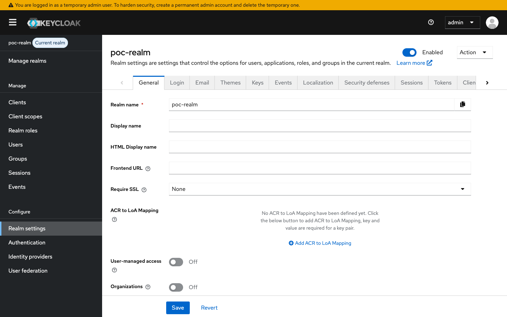

The defaults are fine. The only field the POC's realm-setup script touches
explicitly is the access-token lifespan (set to `300` seconds = 5 minutes).
You can verify it on the **Tokens** tab.

---

## 4.6 Public OIDC endpoints

Keycloak publishes the realm's OIDC discovery doc at:

```
http://127.0.0.1:30888/realms/poc-realm/.well-known/openid-configuration
```

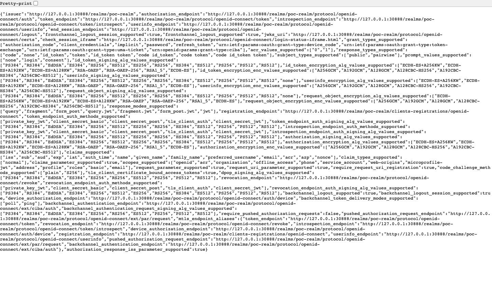

Pod-b's Spring Security configuration uses this URL (indirectly, via
`spring.security.oauth2.resourceserver.jwt.issuer-uri`) to discover both the
JWKS endpoint (for signature verification) and the expected `iss` claim:

```yaml
# pod-b/src/main/resources/application.yml
spring:
  security:
    oauth2:
      resourceserver:
        jwt:
          issuer-uri: http://poc-keycloak.poc-keycloak.svc.cluster.local:8080/realms/poc-realm
          jwk-set-uri: ${spring.security.oauth2.resourceserver.jwt.issuer-uri}/protocol/openid-connect/certs
```

Useful related URLs:

| Endpoint | Returns |
|---|---|
| `…/realms/poc-realm/.well-known/openid-configuration` | OIDC discovery doc (issuer, token endpoint, JWKS, …) |
| `…/realms/poc-realm/protocol/openid-connect/certs` | JWKS — RS256 public keys, refreshed when keys rotate |
| `…/realms/poc-realm/protocol/openid-connect/token` | The token endpoint pod-a POSTs to |

---

## 4.7 What the realm-setup script doesn't do (intentionally)

For the slimmest possible POC, the realm-setup script **does not**:

* Configure an Identity Provider (`identity-provider/instances`) — the
  earlier IdW broker design (validate K8s SA token via OIDC IdP) is
  documented in [01-overview.md](./01-overview.md#architectural-pivots-made-during-build)
  but not used here.
* Enable fine-grained authz / token-exchange permission policies — these
  matter only for the broker flow.
* Create regular human users (the realm has no `users` you can log in as
  via the account console). Only the auto-created service-account user
  exists.
* Configure email/SMTP, themes, password policies, …

Everything the script *does* configure can be re-applied idempotently — drop
the realm (`DELETE /admin/realms/poc-realm`) and re-run the script.

---

Next → [05-manual-testing-guide.md](./05-manual-testing-guide.md)
