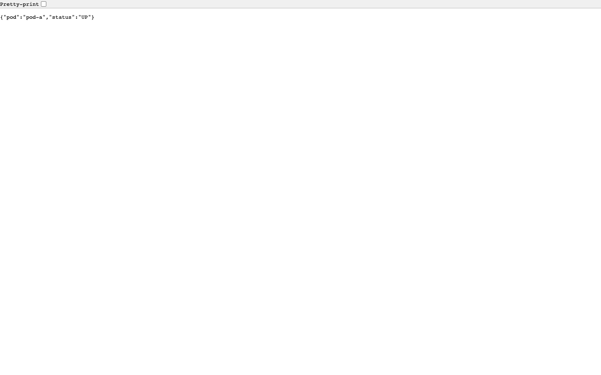
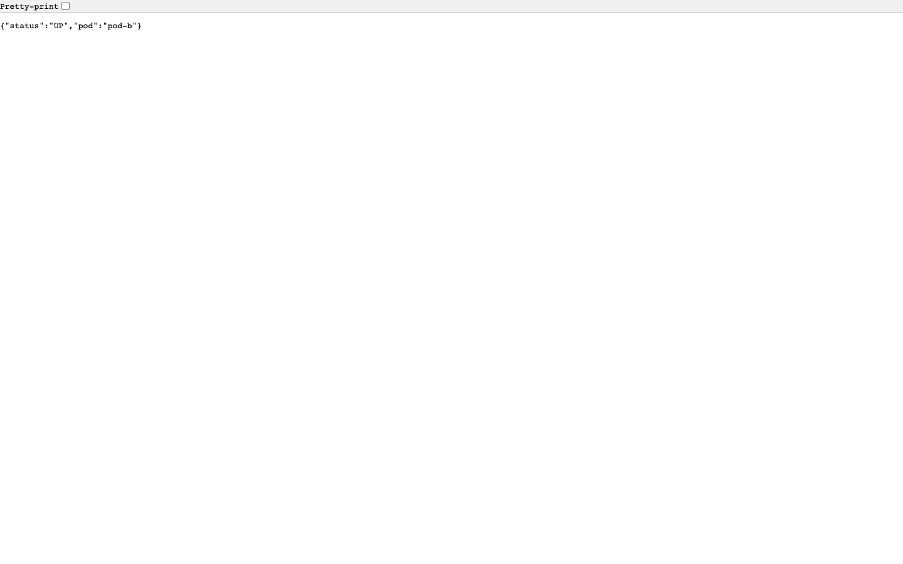
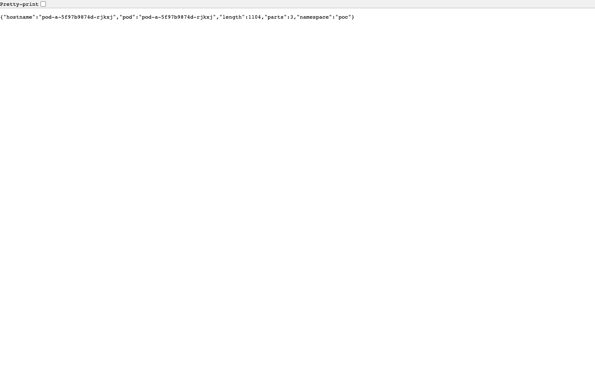
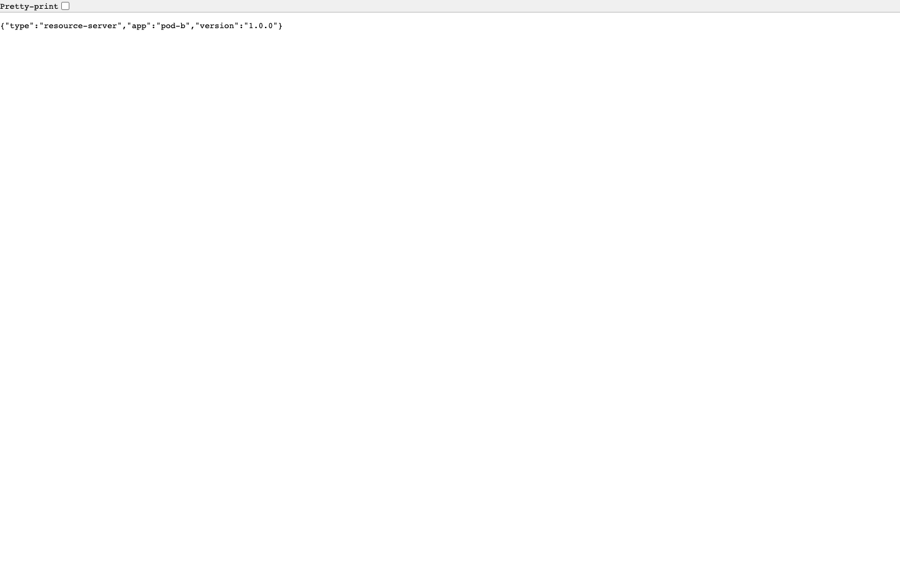

# 05 — Manual Testing Guide

This guide is a curated set of `curl`-based scenarios you can run by hand to
exercise every angle of the POC: happy path, RBAC denials, audit logs, JWT
inspection, performance probes. It's designed to be readable both as a study
guide and as a manual smoke-test checklist.

> All scenarios assume the bootstrap has run
> (`./scripts/00-setup-all.sh`) and that the three host ports
> 30810/30820/30888 are reachable.

---

## Table of contents

* [Pre-flight — sanity checks](#pre-flight--sanity-checks)
* [Scenario 1 — Happy path (full flow)](#scenario-1--happy-path-full-flow)
* [Scenario 2 — Inspect the JWT claims](#scenario-2--inspect-the-jwt-claims)
* [Scenario 3 — RBAC negative tests](#scenario-3--rbac-negative-tests)
* [Scenario 4 — Token caching](#scenario-4--token-caching)
* [Scenario 5 — Inspect the mounted SA token](#scenario-5--inspect-the-mounted-sa-token)
* [Scenario 6 — Audit log scraping](#scenario-6--audit-log-scraping)
* [Scenario 7 — Service-to-service identity preservation](#scenario-7--service-to-service-identity-preservation)
* [Scenario 8 — Concurrent / load probe](#scenario-8--concurrent--load-probe)
* [Scenario 9 — Keycloak admin REST inspection](#scenario-9--keycloak-admin-rest-inspection)
* [Scenario 10 — Resilience: rotate Keycloak](#scenario-10--resilience-rotate-keycloak)
* [Manual test checklist](#manual-test-checklist)

---

## Pre-flight — sanity checks

```bash
# Cluster context
kubectl config current-context        # must be: kind-poc-cluster

# Namespaces
kubectl get ns | grep -E '^(poc|poc-keycloak)'

# Pods
kubectl -n poc-keycloak get pod       # 1/1 Running
kubectl -n poc get pod                # pod-a + pod-b each 1/1 Running

# Host ports
curl -sf http://127.0.0.1:30888/realms/poc-realm/.well-known/openid-configuration | jq -r .issuer
# → http://poc-keycloak.poc-keycloak.svc.cluster.local:8080/realms/poc-realm
```

| Healthcheck | Endpoint | Expected |
|---|---|---|
| pod-a | `GET http://127.0.0.1:30810/api/health` | `{"status":"UP","pod":"pod-a"}` |
| pod-b | `GET http://127.0.0.1:30820/api/health` | `{"status":"UP","pod":"pod-b"}` |




---

## Scenario 1 — Happy path (full flow)

This is what `scripts/07-test-flow.sh` automates; here are the equivalent
manual commands.

```bash
# 1. Trigger the token exchange (client_credentials)
curl -sf -X POST http://127.0.0.1:30810/api/exchange | jq .
```

Expected response:
```json
{
  "accessToken": "eyJhbGciOiJSUzI1NiIs…",
  "tokenType": "Bearer",
  "expiresIn": 300,
  "issuedAt": "2026-05-03T20:04:18.123Z"
}
```

```bash
# 2. Capture the token and call pod-b's protected endpoint
TOKEN=$(curl -sf -X POST http://127.0.0.1:30810/api/exchange | jq -r .accessToken)
curl -sf -H "Authorization: Bearer $TOKEN" \
  http://127.0.0.1:30820/api/protected/data | jq .
```

Expected:
```json
{
  "source": "pod-b",
  "callerIdentity": "<UUID of service-account-pod-a>",
  "dataset": "protected",
  "items": [
    {"id": 1, "name": "alpha"},
    {"id": 2, "name": "beta"}
  ],
  "served-at": "2026-05-03T20:04:21.456Z",
  "roles": [
    "ROLE_default-roles-poc-realm", "ROLE_offline_access",
    "ROLE_data-reader", "ROLE_uma_authorization",
    "ROLE_manage-account", "ROLE_view-profile",
    "ROLE_manage-account-links", "ROLE_data-writer"
  ]
}
```

```bash
# 3. Pod-a service-to-service call (uses cached token internally)
curl -sf http://127.0.0.1:30810/api/call-pod-b | jq .
```

---

## Scenario 2 — Inspect the JWT claims

```bash
TOKEN=$(curl -sf -X POST http://127.0.0.1:30810/api/exchange | jq -r .accessToken)
echo "$TOKEN" | cut -d. -f2 | python3 -c '
import sys, base64, json
t = sys.stdin.read().strip()
t += "=" * (-len(t) % 4)
print(json.dumps(json.loads(base64.urlsafe_b64decode(t)), indent=2))
'
```

Expected payload (truncated):
```json
{
  "exp": 1777837664,
  "iat": 1777837364,
  "iss": "http://poc-keycloak.poc-keycloak.svc.cluster.local:8080/realms/poc-realm",
  "aud": ["pod-b", "account"],
  "sub": "<UUID>",
  "azp": "pod-a",
  "client_id": "pod-a",
  "preferred_username": "service-account-pod-a",
  "realm_access": {
    "roles": ["data-reader", "data-writer", ...]
  }
}
```

Verification table:

| Claim | Expected value | Why |
|---|---|---|
| `iss` | `…/realms/poc-realm` | Pod-b's `issuer-uri` |
| `aud` | contains `pod-b` | Audience mapper on pod-a |
| `azp` | `pod-a` | Authorised party = pod-a client |
| `client_id` | `pod-a` | Same |
| `realm_access.roles` | contains `data-reader` and `data-writer` | Realm-role assignment to SA user |
| `exp - iat` | 300 | 5-min access TTL |

**Quick alternative** — pod-a exposes a debug endpoint that decodes the
mounted K8s SA token's metadata (NOT the Keycloak access token):

```bash
curl -sf http://127.0.0.1:30810/api/oidc/token-info | jq .
# {
#   "namespace": "poc",
#   "pod": "pod-a-...",
#   "hostname": "pod-a-...",
#   "length": 1096,
#   "parts": 3
# }
```



---

## Scenario 3 — RBAC negative tests

| # | Request | Expected status | Expected body |
|---|---|---|---|
| 3.1 | `GET /api/public/info` (no auth) | **200** | `{"app":"pod-b",…}` |
| 3.2 | `GET /api/protected/data` (no auth) | **401** | (empty) |
| 3.3 | `GET /api/protected/data` with `Bearer not-a-jwt` | **401** | (empty) |
| 3.4 | `GET /api/protected/data` with valid token | **200** | data + `callerIdentity` |
| 3.5 | `POST /api/protected/create` (no auth) | **401** | (empty) |
| 3.6 | `POST /api/protected/create` with valid token | **201** | created payload |

Commands:

```bash
# 3.1 public endpoint
curl -i -sf http://127.0.0.1:30820/api/public/info

# 3.2 protected, no auth
curl -i -s -o /dev/null -w "HTTP %{http_code}\n" http://127.0.0.1:30820/api/protected/data
# → HTTP 401

# 3.3 invalid token
curl -i -s -o /dev/null -w "HTTP %{http_code}\n" \
  -H "Authorization: Bearer not-a-jwt" \
  http://127.0.0.1:30820/api/protected/data
# → HTTP 401

# 3.4 valid token (200)
TOKEN=$(curl -sf -X POST http://127.0.0.1:30810/api/exchange | jq -r .accessToken)
curl -sf -H "Authorization: Bearer $TOKEN" http://127.0.0.1:30820/api/protected/data | jq .

# 3.5 + 3.6 POST endpoint
curl -i -s -o /dev/null -w "HTTP %{http_code}\n" \
  -X POST http://127.0.0.1:30820/api/protected/create
# → HTTP 401

curl -sf -X POST -H "Authorization: Bearer $TOKEN" \
  -H "Content-Type: application/json" \
  -d '{"name":"manual-test"}' \
  http://127.0.0.1:30820/api/protected/create | jq .
# → 201
```



### Tampered signature

```bash
# Take a real token, mangle the signature segment, expect 401
TOKEN=$(curl -sf -X POST http://127.0.0.1:30810/api/exchange | jq -r .accessToken)
HEADER=$(echo $TOKEN | cut -d. -f1)
PAYLOAD=$(echo $TOKEN | cut -d. -f2)
TAMPERED="$HEADER.$PAYLOAD.AAAAAAAAAAAAAAAAAAAAAAAAAAAAAA"
curl -i -s -o /dev/null -w "HTTP %{http_code}\n" \
  -H "Authorization: Bearer $TAMPERED" \
  http://127.0.0.1:30820/api/protected/data
# → HTTP 401
```

---

## Scenario 4 — Token caching

Pod-a caches the access token until 30s before expiry; subsequent
`/api/tokens/current` returns the cached value.

```bash
# Trigger an exchange (this seeds the cache)
T1=$(curl -sf -X POST http://127.0.0.1:30810/api/exchange | jq -r .accessToken)

# Read the cached token
T2=$(curl -sf http://127.0.0.1:30810/api/tokens/current | jq -r .token)

# They should match
[ "$T1" = "$T2" ] && echo "✅ cached" || echo "❌ different"

# Now trigger a fresh exchange — the new token replaces the cached one
T3=$(curl -sf -X POST http://127.0.0.1:30810/api/exchange | jq -r .accessToken)
[ "$T1" != "$T3" ] && echo "✅ new token issued" || echo "❌ same token (jti changed?)"
```

Cached vs fresh tokens differ only by their `jti` claim and the trailing
RSA signature; payloads other than `jti`/`iat`/`exp` are identical.

---

## Scenario 5 — Inspect the mounted SA token

The mounted token at `/var/run/secrets/tokens/jwt.token` is the Kubernetes
**service-account token**, separate from the Keycloak access token. Demo
inspection (no exchange needed):

```bash
kubectl -n poc exec deploy/pod-a -- cat /var/run/secrets/tokens/jwt.token \
  | tr -d '\n' | cut -d. -f2 \
  | python3 -c '
import sys, base64, json
t = sys.stdin.read().strip()
t += "=" * (-len(t) % 4)
print(json.dumps(json.loads(base64.urlsafe_b64decode(t)), indent=2))
'
```

Expected (the K8s API server is the issuer):
```json
{
  "aud": ["keycloak-poc"],
  "iss": "https://kubernetes.default.svc.cluster.local",
  "sub": "system:serviceaccount:poc:pod-a",
  "kubernetes.io": {
    "namespace": "poc",
    "node": { "name": "poc-cluster-control-plane", "uid": "..." },
    "pod":  { "name": "pod-a-...", "uid": "..." },
    "serviceaccount": { "name": "pod-a", "uid": "..." }
  },
  "exp": ..., "iat": ..., "nbf": ...
}
```

The token's *audience* (`keycloak-poc`) is set by the projected-volume
config in [`../k8s-manifests/poc/03-pod-a-deployment.yaml`](../k8s-manifests/poc/03-pod-a-deployment.yaml#L62-L72).

---

## Scenario 6 — Audit log scraping

Every protected request to pod-b emits a structured audit log line. Tail
them with:

```bash
kubectl -n poc logs deploy/pod-b -f | grep AUDIT
```

Trigger a request from another shell:
```bash
TOKEN=$(curl -sf -X POST http://127.0.0.1:30810/api/exchange | jq -r .accessToken)
curl -sf -H "Authorization: Bearer $TOKEN" http://127.0.0.1:30820/api/protected/data >/dev/null
```

Expected line in the log tail:
```
INFO  c.e.podb.audit.AuditLogger - AUDIT: {"timestamp":"2026-05-03T20:05:33.456Z","method":"GET","endpoint":"/api/protected/data","caller":"<UUID>","roles":["ROLE_data-reader","ROLE_data-writer",…],"outcome":"ALLOWED"}
```

This is what the e2e suite asserts in
[`../e2e-tests/tests/04-failure-recovery.spec.ts`](../e2e-tests/tests/04-failure-recovery.spec.ts).

---

## Scenario 7 — Service-to-service identity preservation

```bash
# Get a fresh token, decode its sub claim
TOKEN=$(curl -sf -X POST http://127.0.0.1:30810/api/exchange | jq -r .accessToken)
SUB=$(echo $TOKEN | cut -d. -f2 | python3 -c '
import sys, base64, json
t = sys.stdin.read().strip(); t += "=" * (-len(t) % 4)
print(json.loads(base64.urlsafe_b64decode(t))["sub"])
')
echo "Token sub: $SUB"

# Now call pod-b
curl -sf -H "Authorization: Bearer $TOKEN" \
  http://127.0.0.1:30820/api/protected/data | jq -r .callerIdentity
# → must equal $SUB
```

This proves the JWT subject (Keycloak's UUID for the service-account user)
is preserved across the network boundary — pod-b's `auth.getName()` returns
exactly what was in the token's `sub` claim.

---

## Scenario 8 — Concurrent / load probe

A quick stress probe (matching e2e suite #07):

```bash
TOKEN=$(curl -sf -X POST http://127.0.0.1:30810/api/exchange | jq -r .accessToken)

# 10 concurrent requests
for i in $(seq 1 10); do
  (curl -s -o /dev/null -w "req $i: HTTP %{http_code} — %{time_total}s\n" \
    -H "Authorization: Bearer $TOKEN" \
    http://127.0.0.1:30820/api/protected/data) &
done
wait
```

Expected:
```
req 1: HTTP 200 — 0.034s
req 2: HTTP 200 — 0.041s
... (all 200, all under ~150 ms)
```

The Playwright `07-performance.spec.ts` verifies the same in CI.

---

## Scenario 9 — Keycloak admin REST inspection

Useful one-liners for poking the admin API directly:

```bash
ADMIN_TOKEN=$(curl -sf -X POST \
  http://127.0.0.1:30888/realms/master/protocol/openid-connect/token \
  -H 'Content-Type: application/x-www-form-urlencoded' \
  -d 'username=admin&password=admin&grant_type=password&client_id=admin-cli' \
  | jq -r .access_token)

# Realm overview
curl -sf -H "Authorization: Bearer $ADMIN_TOKEN" \
  http://127.0.0.1:30888/admin/realms/poc-realm | jq '{realm,enabled,accessTokenLifespan}'

# All clients in poc-realm
curl -sf -H "Authorization: Bearer $ADMIN_TOKEN" \
  http://127.0.0.1:30888/admin/realms/poc-realm/clients \
  | jq '[.[] | {clientId, enabled, serviceAccountsEnabled}]'

# pod-a's role mappings
POD_A_ID=$(curl -sf -H "Authorization: Bearer $ADMIN_TOKEN" \
  "http://127.0.0.1:30888/admin/realms/poc-realm/clients?clientId=pod-a&exact=true" | jq -r '.[0].id')
SA_USER_ID=$(curl -sf -H "Authorization: Bearer $ADMIN_TOKEN" \
  "http://127.0.0.1:30888/admin/realms/poc-realm/clients/$POD_A_ID/service-account-user" | jq -r .id)
curl -sf -H "Authorization: Bearer $ADMIN_TOKEN" \
  "http://127.0.0.1:30888/admin/realms/poc-realm/users/$SA_USER_ID/role-mappings/realm" \
  | jq '[.[] | .name]'
# → ["data-reader", "data-writer"]
```

---

## Scenario 10 — Resilience: rotate Keycloak

```bash
# Restart Keycloak (H2 in-memory wipes the realm)
kubectl -n poc-keycloak rollout restart deploy/poc-keycloak
kubectl -n poc-keycloak rollout status deploy/poc-keycloak

# Re-seed the realm (the script is idempotent and tolerant of empty DB)
./scripts/04-setup-poc-realm.sh

# Pod-a's circuit breaker may have tripped during the outage —
# trigger a refresh:
kubectl -n poc rollout restart deploy/pod-a
kubectl -n poc rollout status deploy/pod-a

# Verify the system recovered
./scripts/07-test-flow.sh
```

This validates:
- Realm setup is fully scriptable / repeatable
- Pod-a recovers from a Keycloak restart (Resilience4j circuit breaker)
- Pod-b refetches JWKS on first request after kid rotation

---

## Manual test checklist

Use this when prepping a demo or reviewing a change:

- [ ] `00-setup-all.sh` completes without warnings
- [ ] `kubectl get pod -A | grep -E '(poc|poc-keycloak)'` shows 3 Running pods
- [ ] Keycloak admin UI loads at http://127.0.0.1:30888 (admin / admin)
- [ ] `poc-realm` exists and contains 2 clients (`pod-a`, `pod-b`) + 2 roles
- [ ] `service-account-pod-a` user has `data-reader` + `data-writer` realm roles
- [ ] pod-a `/api/health` → 200
- [ ] pod-b `/api/health` → 200
- [ ] pod-b `/api/protected/data` no auth → 401
- [ ] pod-b `/api/protected/data` invalid token → 401
- [ ] pod-a `/api/exchange` returns a 3-part JWT
- [ ] Decoded JWT has `aud` containing `pod-b`, `realm_access.roles` contains both roles
- [ ] pod-b `/api/protected/data` with token → 200
- [ ] pod-b `/api/protected/create` with token → 201
- [ ] pod-a `/api/call-pod-b` → 200, response.message = "Successfully called Pod B"
- [ ] `kubectl logs deploy/pod-b` contains lines starting with `AUDIT:`
- [ ] Playwright `08-run-e2e.sh` → 45 / 45 pass
- [ ] `99-cleanup.sh` deletes the `poc-cluster` and leaves no stray namespaces or socat containers

---

Next → [06-code-walkthrough.md](./06-code-walkthrough.md)
