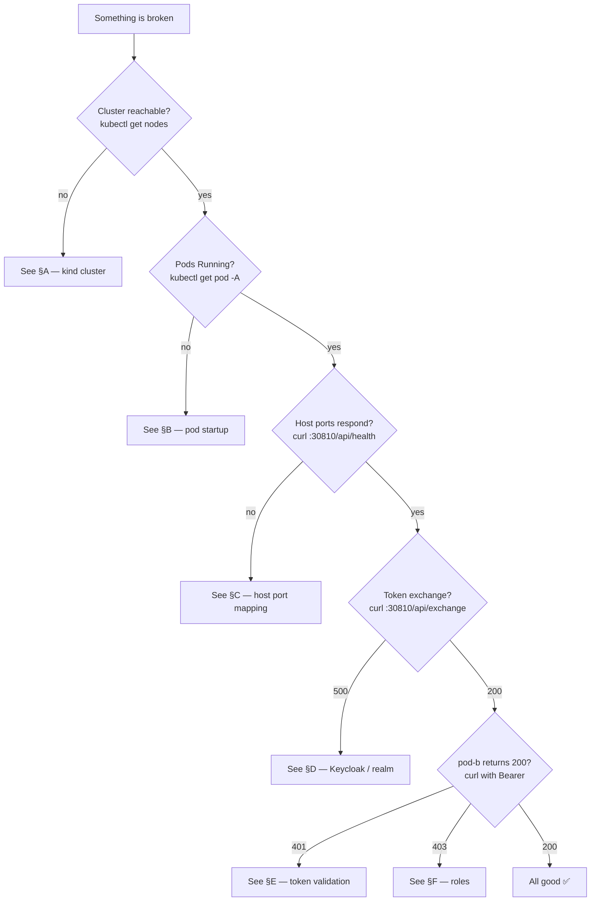

# 07 — Troubleshooting

Symptoms ↔ root causes ↔ fixes — distilled from issues actually hit while
building this POC. Each section names the failure mode you'll see, what
to look for in logs, and the smallest fix.

---

## Quick triage chart



---

## §A — kind cluster issues

### A.1 `kind: command not found`
Install kind: https://kind.sigs.k8s.io/docs/user/quick-start/#installation

### A.2 Cluster won't create — port already bound
```
ERROR: failed to create cluster: ports binding to 0.0.0.0:30888 → … is already in use
```

Another cluster (or socat proxy) on your host owns 30810/30820/30888.
```bash
# Show what owns the host port
sudo lsof -nP -i:30888 | head
# Common culprits and how to fix
docker rm -f $(docker ps -aq --filter expose=30888)   # rogue containers
./scripts/99-cleanup.sh                     # if a previous POC run is still around
```

### A.3 `kindest/node:vX.Y.Z` image pull stalls
`docker pull kindest/node:v1.35.0` ahead of time, or set `KIND_NODE_IMAGE`
to a smaller specific tag.

### A.4 Wrong kubectl context
```bash
kubectl config current-context
# expected: kind-poc-cluster — if not:
kubectl config use-context kind-poc-cluster
```

---

## §B — pod startup issues

### B.1 `ImagePullBackOff` on pod-a or pod-b

The image must be **loaded into kind** (`kind load docker-image`). Loading
is automatic in `scripts/05-build-and-load.sh`. Verify:
```bash
docker exec poc-cluster-control-plane crictl images | grep pod-
# pod-a:latest    docker.io/library    ...   ...MB
# pod-b:latest    docker.io/library    ...   ...MB
```

If the images are missing, re-run:
```bash
./scripts/05-build-and-load.sh
kubectl -n poc rollout restart deploy/pod-a deploy/pod-b
```

### B.2 `CrashLoopBackOff` on poc-keycloak

Most common cause: **conflicting `KC_FEATURES` flag combinations**. The
deployment ships with:
```yaml
KC_FEATURES: "token-exchange:v1,admin-fine-grained-authz:v1"
```

If you edited it to something like `admin-fine-grained-authz:v1,admin-fine-grained-authz:v2`, Keycloak refuses to start:
```
ERROR: Multiple versions of the same feature admin-fine-grained-authz:v2, admin-fine-grained-authz:v1 should not be enabled.
```

Fix: pick one version. Keep `:v1` for this POC (the legacy `/management/permissions` endpoint requires it; v2 has a different API).

### B.3 pod-a starts but `/api/exchange` returns 500 with no Keycloak event

Look at the actual stack trace:
```bash
kubectl -n poc logs deploy/pod-a --tail=200 \
  | grep -E "(Token exchange|ERROR|Caused by)" | head -10
```

| Pattern in logs | Cause | Fix |
|---|---|---|
| `java.time.Instant not supported by default` | Custom `@Bean ObjectMapper` overriding Spring's auto-config | Remove the bean — Spring Boot's auto-configured ObjectMapper has `JavaTimeModule`. See `RestTemplateConfig.java`. |
| `IllegalStateException: OIDC token not mounted` | `serviceAccountToken` projected volume missing | Re-apply `k8s-manifests/poc/03-pod-a-deployment.yaml` |
| `Connection refused` to Keycloak | `KEYCLOAK_SERVER_URL` env wrong, or Keycloak not Ready | `kubectl -n poc-keycloak get pod`; fix env in deployment |

---

## §C — host port mapping issues

### C.1 `curl http://127.0.0.1:30810` hangs or `connection refused`

The `extraPortMappings` block in `poc-cluster-config.yaml` only takes effect
**at cluster creation**. If you edited that file *after* creating the
cluster, the new mappings won't apply until you recreate.

```bash
./scripts/99-cleanup.sh         # destroys & recreates poc-cluster
./scripts/00-setup-all.sh       # full bootstrap
```

### C.2 Port works for pod-a but not for pod-b (or vice-versa)

Check the Service's `nodePort`:
```bash
kubectl -n poc get svc pod-a -o jsonpath='{.spec.ports[0].nodePort}{"\n"}'
# expected: 30810
kubectl -n poc get svc pod-b -o jsonpath='{.spec.ports[0].nodePort}{"\n"}'
# expected: 30820
```

If the values don't match the kind-config's `containerPort` entries, fix
either the Service nodePort or the kind-config `extraPortMappings`.

---

## §D — Keycloak / realm issues

### D.1 `/api/exchange` returns 401 with `error=invalid_client`

```bash
kubectl -n poc logs deploy/pod-a --tail=20 | grep -i "401\|invalid_client"
```

The `KEYCLOAK_CLIENT_SECRET` env in pod-a's deployment doesn't match the
secret stored on the `pod-a` client in Keycloak. The realm-setup script
creates `pod-a-secret`. If you reset the realm and used a different secret:

```bash
# Re-fetch the actual secret from Keycloak admin REST
ADMIN=$(curl -sf -X POST http://127.0.0.1:30888/realms/master/protocol/openid-connect/token \
  -H 'Content-Type: application/x-www-form-urlencoded' \
  -d 'username=admin&password=admin&grant_type=password&client_id=admin-cli' | jq -r .access_token)
POD_A_ID=$(curl -sf -H "Authorization: Bearer $ADMIN" \
  'http://127.0.0.1:30888/admin/realms/poc-realm/clients?clientId=pod-a&exact=true' | jq -r '.[0].id')
curl -sf -H "Authorization: Bearer $ADMIN" \
  "http://127.0.0.1:30888/admin/realms/poc-realm/clients/${POD_A_ID}/client-secret" | jq .
# → {"type":"secret","value":"pod-a-secret"}
```

If the value is different, either reset the secret via PUT or update the
deployment env to match.

### D.2 `/api/exchange` returns 400 `error=unauthorized_client`

Pod-a's client doesn't have `serviceAccountsEnabled=true`. Recreate the
realm:
```bash
./scripts/04-setup-poc-realm.sh
```

### D.3 Realm seems empty after Keycloak restart

H2 in-memory wipes on restart by design. Re-run the realm setup:
```bash
./scripts/04-setup-poc-realm.sh
```

If you need persistence, that's plan-10 territory (PostgreSQL backend).

### D.4 The Keycloak admin UI shows "Page Not Found"

Two common causes:
- You're navigating directly to a hash URL like `#/poc-realm/clients`. The
  Keycloak admin SPA route format is `#/realms/poc-realm/clients` for some
  versions and `#/poc-realm/clients` for others — but neither is reliable as
  a deep link. **Always navigate via the sidebar instead of bookmarking.**
- The admin URL has `/admin/master/console/` baked in even when you're
  working in `poc-realm` — that's fine, the React SPA switches its internal
  realm context independently of the URL.

---

## §E — token validation issues (pod-b returns 401)

### E.1 `Bearer error="invalid_token", error_description="Invalid signature"`

Pod-b can't verify the JWT against Keycloak's JWKS.

Check pod-b's logs:
```bash
kubectl -n poc logs deploy/pod-b --tail=30 \
  | grep -iE "(signature|jwks|issuer|jwt)"
```

Common causes:
- **Wrong `issuer-uri`**: the env should match what Keycloak emits in `iss`.
  `kubectl -n poc get deploy pod-b -o jsonpath='{.spec.template.spec.containers[0].env}'`
- **Keycloak restarted and the signing key rotated**, but pod-b cached the
  old JWKS. Spring Security caches by `kid`; once the kid rotates, the
  next request will trigger a JWKS refresh. If pod-b is wedged, restart it:
  ```bash
  kubectl -n poc rollout restart deploy/pod-b
  ```

### E.2 `Bearer error="invalid_token", error_description="Token used before issued"`

Clock skew between Keycloak and pod-b. In a kind cluster this is rare but
can happen on resumed laptops. Restart both:
```bash
kubectl -n poc-keycloak rollout restart deploy/poc-keycloak
kubectl -n poc rollout restart deploy/pod-a deploy/pod-b
```

### E.3 `Bearer error="insufficient_scope"`

You're being denied at `@PreAuthorize` — see §F.

---

## §F — RBAC / role issues (pod-b returns 403)

### F.1 `403 Forbidden` despite a valid 200-on-exchange token

```bash
TOKEN=$(curl -sf -X POST http://127.0.0.1:30810/api/exchange | jq -r .accessToken)
echo "$TOKEN" | cut -d. -f2 | python3 -c '
import sys, base64, json
t = sys.stdin.read().strip(); t += "=" * (-len(t) % 4)
print(json.dumps(json.loads(base64.urlsafe_b64decode(t)).get("realm_access", {}), indent=2))
'
```

If `realm_access.roles` does **not** include `data-reader` / `data-writer`,
the SA-user role mapping is missing:

```bash
./scripts/04-setup-poc-realm.sh   # idempotent — re-applies role assignment
kubectl -n poc rollout restart deploy/pod-a  # invalidate token cache
```

If roles are present but `@PreAuthorize` still denies, check that
`PocJwtAuthenticationConverter` is actually wired in. Search the pod-b log
for the converter being called:
```bash
kubectl -n poc logs deploy/pod-b | grep "JWT auth"
# Should show: JWT auth: subject=..., authorities=[ROLE_data-reader, ROLE_data-writer, ...]
```

### F.2 Role names are mapped without `ROLE_` prefix

Spring Security's `hasRole("X")` checks for `ROLE_X` — if your converter
emits `data-reader` instead of `ROLE_data-reader`, all `@PreAuthorize`
checks fail with 403. Fix in
[`PocJwtAuthenticationConverter.java`](../pod-b/src/main/java/com/example/podb/auth/PocJwtAuthenticationConverter.java).

---

## §G — Playwright / e2e issues

### G.1 `connect ECONNREFUSED 127.0.0.1:30810`

Pods aren't reachable on the host. See §C.

### G.2 Tests fail with "expected 200, got 401" on the very first request

JWT validation is failing — see §E. To debug:
```bash
cd e2e-tests
PLAYWRIGHT_HTML_OPEN=always npx playwright test --project=chromium tests/01-token-exchange.spec.ts
# Then click into the failed test in the HTML report to see the actual response body
```

### G.3 `kubectl logs` test (audit-log scrape) is skipped

The test skips if `kubectl` isn't on `PATH` for the Playwright process.
Run from a shell that has `kubectl` available (typically: just don't use
restricted shells / `nvm` shells without `$PATH` exported).

### G.4 Browser binaries missing

```bash
cd e2e-tests
npx playwright install chromium
# (or `chromium firefox webkit` for the full matrix)
```

---

## §H — Common log-level reference

When debugging, raise log levels:

**pod-a / pod-b** — set the env var on the deployment:
```bash
kubectl -n poc set env deploy/pod-a LOGGING_LEVEL_COM_EXAMPLE_PODA=DEBUG
kubectl -n poc set env deploy/pod-b LOGGING_LEVEL_ORG_SPRINGFRAMEWORK_SECURITY=DEBUG
```

**Keycloak** — set `KC_LOG_LEVEL`:
```bash
kubectl -n poc-keycloak set env deploy/poc-keycloak \
  KC_LOG_LEVEL=INFO,org.keycloak.protocol.oidc:DEBUG,org.keycloak.events:DEBUG
```

Always restart afterwards:
```bash
kubectl -n poc rollout restart deploy/pod-a deploy/pod-b
kubectl -n poc-keycloak rollout restart deploy/poc-keycloak
```

---

## §I — When everything is broken: nuke and pave

```bash
./scripts/99-cleanup.sh           # delete poc-cluster + leftover proxies
./scripts/00-setup-all.sh         # rebuild from scratch
./scripts/08-run-e2e.sh           # confirm 45/45 green
```

Five minutes warm, ten cold. Cheaper than debugging.

---

← Back to [README](./README.md)
